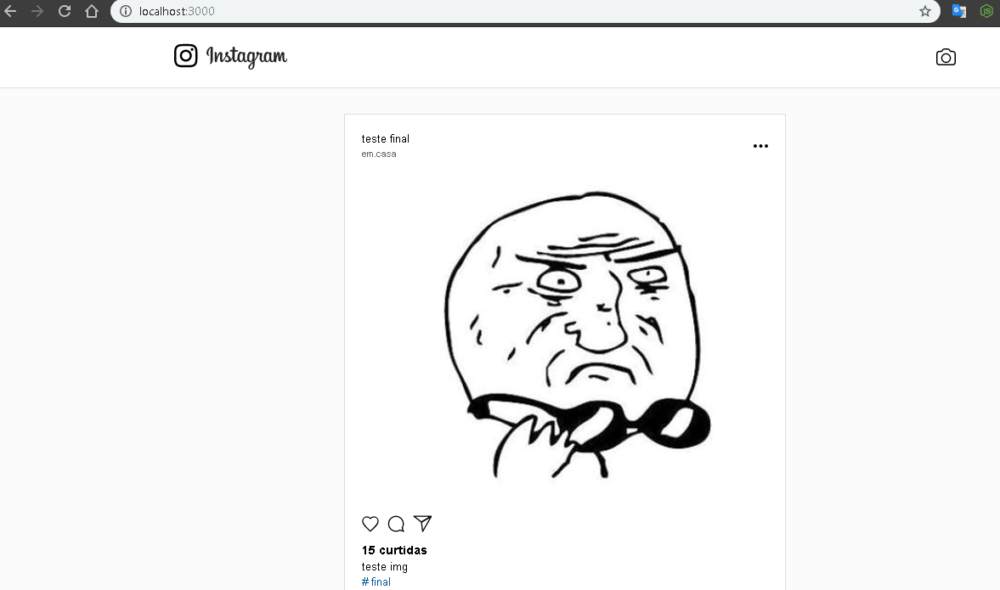

# myInsta
myInsta usando nodeJS, react e react native

Bibliotecas utilizadas 

##Backend
- express
- nodemon
- multer 
- sharp
- cors
- socket.io

##Frontend Web
- ES6
- ReactJS
- react router dom
- axios
- socket.io-client

##Frontend Mobile
- ES6
- ReactJS
- react-navigation
- react-native-gesture-handler
- axios
- socket.io-client
- react-native-image-picker
##Oberservações
Nem todas as funcionalidades estão implementadas, pois é apenas um projeto de estudo.

## Screenshots

Anderson V. Bellini

Mais informações sobre meu perfil profissional em 
[Linkedin](http://www.linkedin.com/in/abellini)